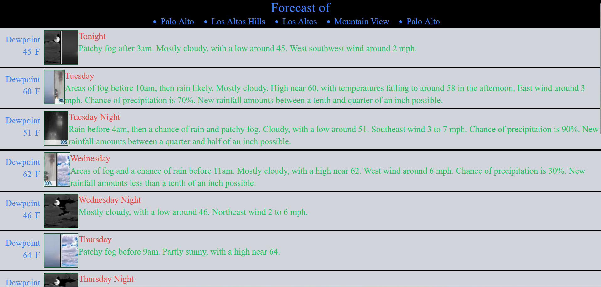

# Weather Forecast Monitoring

This is a [Next.js](https://nextjs.org/) project Tailwindcss with (https://github.com/vercel/next.js/tree/canary/packages/create-next-app). It's designed to monitor and display weather forecasts for the Silicon Valley area.

## Weather API



This project uses the [National Weather Service API](https://api.weather.gov) to fetch the daily weather forecast for the Silicon Valley area. The data is fetched from the following endpoint:

`https://api.weather.gov/gridpoints/MTR/92,86/forecast`

## Getting Started

First, run the development server:

```bash
npm run dev
# or
yarn dev
# or
pnpm dev
# or
bun dev
```
